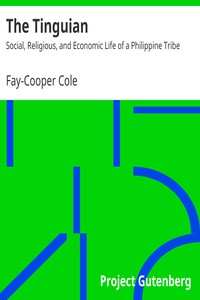

# The Tinguian: Social, Religious, and Economic Life of a Philippine Tribe <kbd>v2.3.0</kbd>

## Authors

 - Cole, Fay-Cooper <small>(1881 - 1961)</small>

## Translators

## Subjects

 - Tinguian (Philippine people)

## Readablility

 - **A1:** 71%
 - **A2:** 77%
 - **B1:** 84%
 - **B2:** 91%
 - **C1:** 97%
 - **C2:** 100%

## Words Count

 - **A1:** 477
 - **A2:** 448
 - **B1:** 799
 - **B2:** 1203
 - **C1:** 1429
 - **C2:** 1012

## Source

<kbd>GUTHENBURGE:12849</kbd>
