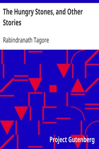

# The Hungry Stones, and Other Stories <kbd>v2.2.1</kbd>

## Authors

 - Tagore, Rabindranath <small>(1861 - 1941)</small>

## Translators

## Subjects

 - India
 - Short stories, Bengali
 - Tagore, Rabindranath, 1861-1941

## Readablility

 - **A1:** 77%
 - **A2:** 83%
 - **B1:** 89%
 - **B2:** 94%
 - **C1:** 98%
 - **C2:** 100%

## Words Count

 - **A1:** 489
 - **A2:** 462
 - **B1:** 801
 - **B2:** 1128
 - **C1:** 1162
 - **C2:** 655

## Source

<kbd>GUTHENBURGE:2518</kbd>
