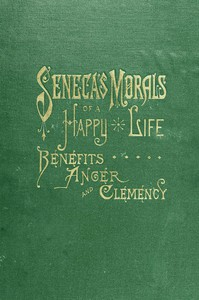

# Seneca's Morals of a Happy Life, Benefits, Anger and Clemency <kbd>v2.2.1</kbd>

## Authors

 - Seneca, Lucius Annaeus <small>(-1 - 65)</small>

## Translators

 - L'Estrange, Roger, Sir <small>(1616 - 1704)</small>

## Subjects

 - Conduct of life
 - Ethics

## Readablility

 - **A1:** 78%
 - **A2:** 83%
 - **B1:** 89%
 - **B2:** 94%
 - **C1:** 98%
 - **C2:** 100%

## Words Count

 - **A1:** 480
 - **A2:** 429
 - **B1:** 782
 - **B2:** 1203
 - **C1:** 1455
 - **C2:** 999

## Source

<kbd>GUTHENBURGE:56075</kbd>
